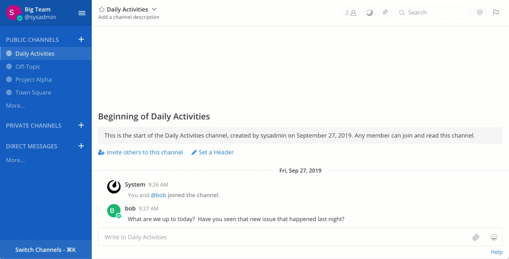

# Mattermost Webex Cloud Plugin

Once enabled, clicking a meeting icon in a Mattermost channel invites team members to join a Webex meeting, hosted using the credentials of the user who initiated the meeting.

