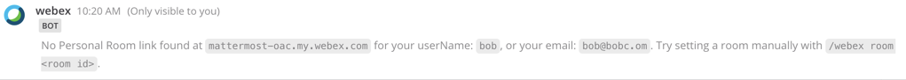

# Settings for Webex

By default, the Webex plugin will use the email associated with your Mattermost account to setup new meetings.  Sometimes, users will use a different email address to login to Webex than they use to login to Mattermost.  In this case, you will need to configure the Webex plugin to use the email address associated with your Webex account to setup meetings.  

If your email or username is different between your Webex and Mattermost accounts - you may encounter this error:

To use a specific Webex account instead of suing your email address from Mattermost - Type `/webex room <room id>` -  Where `<room id>` is your Webex room id.  Meetings you start will use this ID.  This Webex Room ID can be found by:

1. Logging in to your Webex account
2. On the home screen you will see a URL with a username within it \('camille' highlighted in red here as an example\).  That username is what you will enter as `<room id>`.

 This setting is required only if your Webex account email address is different from your Mattermost account email address, or if the username of your email does not match your Personal Meeting Room ID or User name on your Webex site.

If anything changes in the future, and your email with Mattermost and Webex get changed, you can reset the room ID using `/webex room-reset` 

To display your current username settings, simply type `/webex info`

