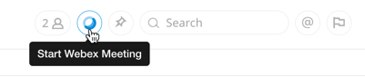
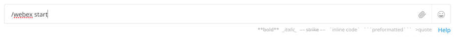
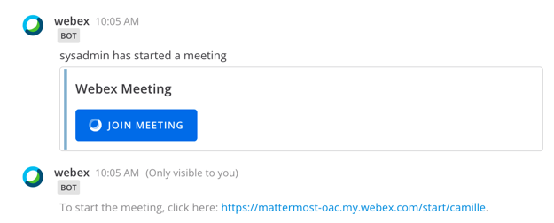

# Using the Webex Plugin

### Starting a Meeting

There are two primary ways of initiating a new Webex Meeting from within Mattermost:

* Clicking the Webex Meeting Button at the top right of the channel 

* or by typing `/webex start` and pressing 'enter' in a chat window

## Joining a Meeting from a channel

If you are the meeting organizer and want to start the meeting for other participants, click on the link that is shown below the "Join Meeting" button.  This link brings you directly to the meeting and will ask you to login to Webex if you haven't already.

If you are joining a meeting as a participant, you will only see the "Join Meeting" button in your channel.  simply click it to be brought to the Webex meeting.

**Advanced Options - Sharing Meetings on behalf of others**

* `/webex <room id>` - Shares a Join Meeting link for the Webex Personal Room meeting that is associated with the specified Personal Room ID, whether it’s your Personal Meeting Room ID or someone else’s.
* `/webex <@mattermost_username>` - Shares a Join Meeting link for the Webex Personal Room meeting that is associated with that Mattermost team member.

If you type `/webex help` in any channel conversation you will be presented with your available options.

